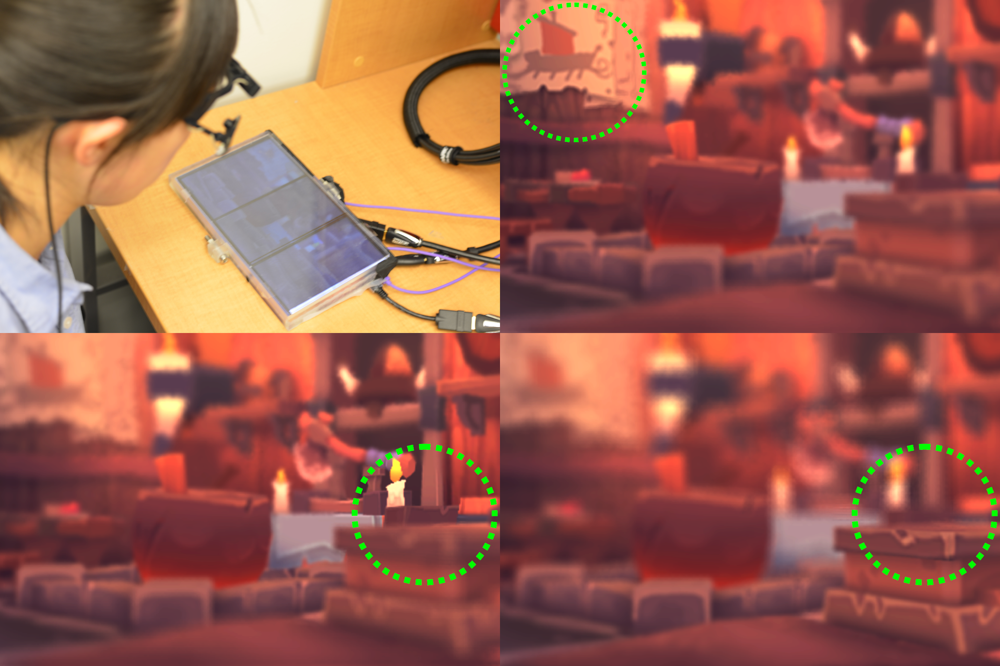

# Perceptually-Guided Foveation for Light Field Displays #

Qi Sun, Fu-Chung Huang, Joohwan Kim, Li-Yi Wei, David Luebke, and Arie Kaufman

SIGGRAPH Asia 2017

## Abstract ##

A variety of applications such as virtual reality and immersive cinema require high image quality, low rendering latency, and consistent depth cues.
4D light field displays support focus accommodation, but are more costly to render than 2D images, resulting in higher latency.

The human visual system can resolve higher spatial frequencies in the fovea than in the periphery.
This property has been harnessed by recent 2D foveated rendering methods to reduce computation cost while maintaining perceptual quality.
Inspired by this, we present foveated 4D light fields by investigating their effects on 3D depth perception.
Based on our psychophysical experiments and theoretical analysis on visual and display bandwidths, we formulate a content-adaptive importance model in the 4D ray space.
We verify our method by building a prototype light field display that can render only 16\%-30\% rays without compromising perceptual quality.

## Available information ##

<!--
[[paper](https://doi.org/10.1145/3130800.3130807)]
-->
[[video (youtube)](https://youtu.be/tx0i30vTqMU)]
